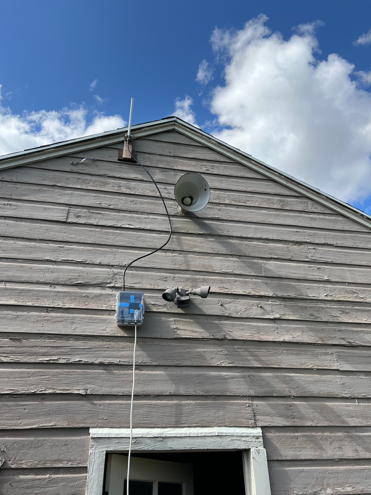

# SX1276 LoRa Range Test - STM32G031K8

A comprehensive range testing project for SX1276 LoRa modules using the **STM32G031K8** microcontroller on the NUCLEO-G031K8 board.

## Overview

This project provides firmware for evaluating SX1276 LoRa module performance across various distances and environmental conditions. The implementation is specifically designed for the STM32G031K8 but includes portable drivers that can be adapted for other STM32 microcontroller boards.

## Hardware Setup

### Primary Configuration
- **Microcontroller**: STM32G031K8 (NUCLEO-G031K8 board)
- **LoRa Module**: RFM95W - Semtech SX1276
- **Development Environment**: STM32CubeIDE
- **Receiver Setup**: STM32 receiver connected to Raspberry Pi Zero (with Wifi AP enabled) via UART
- **Remote Access**: SSH into Raspberry Pi Zero to monitor UART messages from STM32
- **Antennas**: 8dB Omnidirectional 915MHz antenna

### Pin Configuration
```
SX1276 Connections:
- CS:   PB2
- RST:  PA8  
- ENA:  PA9
- IRQ:  PA0 (DIO0)
- SCK:  PA1 (SPI1)
- MISO: PA6 (SPI1)
- MOSI: PA7 (SPI1)

UART Debug: PA2/PA3 (USART2 - 115200 baud)
LED: PC6 (LD3)
```

### Compilation and Flashing
1. Clone this repository
2. Open `sx1276_lora_range_test_g031k8.ioc` in STM32CubeIDE
3. Build the project (Debug or Release configuration)
4. Flash the firmware to your STM32G031K8 board

## Project Images


*SX1276 LoRa module connected to STM32G031K8 NUCLEO board with RPI Zero 2W underneath*

  
*Don't mind the old barn, it was the tallest point I could mount the antenna.*


*7 mile horizontal distance. 1000ft vertical distance.*


*Gaia GPS used on phone to determine range details.*


*Sample UART output showing received messages with RSSI values*

### Direct UART Connection
Connect to STM32's UART directly via USB-serial adapter:
```bash
#!/bin/bash
stty -F /dev/ttyACM0 115200
cat /dev/ttyACM0 &
```
